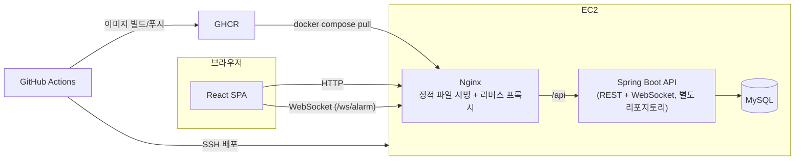

# BABBLE.

머릿속에 떠오른 아무 말이나 편하게 남기는 게시판 서비스입니다. KTB 부트캠프 개인 과제로, 바닐라 JS/HTML/CSS로 만든 기존 프로젝트를 React로 마이그레이션하고 실시간 알림·성능 개선 기능을 추가하는 과정을 담고 있습니다.

## 🚀 Deployment URL

- [BABBLE. 바로가기](http://43.201.26.105/)

## 주요 기능

### 웹소켓 기반 실시간 알림

라이브러리 없이 순수 `WebSocket` API로 구현했습니다. 로그인 상태에서 `ws://{API_BASE_URL}/ws/alarm?token={accessToken}`으로 연결하고, 서버가 보내는 이벤트를 받아 알림 목록 맨 앞에 바로 추가합니다. 로그아웃하면 소켓을 정리(`ws.close()`)합니다.

> [스크린샷/GIF 자리]

### 인기글 랭킹 슬라이드

`GET /posts/popular` 응답 상위 5개를 게시글 목록 상단에서 4초 간격으로 자동 슬라이드하는 배너입니다. 좌우 화살표·인디케이터로 수동 이동도 가능하고, 인기글이 1개뿐이면 타이머 자체를 걸지 않습니다.

> [스크린샷/GIF 자리]

### Contributors

게시글 목록에서 뽑아낸 작성자 정보를 사이드바에 아바타 그리드로 보여줍니다. 프로필 사진이 없으면 `userId` 기반으로 계산한 고정 색상 배경 + 닉네임 첫 글자를 표시해서, 같은 사람은 헤더/목록/상세/댓글/기여자 목록 어디서나 항상 같은 색으로 보입니다.

> [스크린샷/GIF 자리]

### 그 외

- 게시글/댓글 CRUD, 좋아요, 조회수(새로고침 시 중복 방지), 무한 스크롤
- JWT 기반 로그인/회원가입/회원정보·비밀번호 수정/회원 탈퇴
- `alert()`/`confirm()`을 대체하는 Promise 기반 커스텀 모달

## Tech Stacks


**통신**
- REST API (`fetch` 기반 공용 `request()` 래퍼)
- WebSocket (실시간 알림, 별도 라이브러리 없이 네이티브 API 사용)
- GitHub Actions (CI/CD) → GHCR → EC2

## 🗂️ Project Structure

| 폴더명 | 설명 |
|---|---|
| src/api | API 통신 모듈 |
| src/components | 재사용 가능한 UI 컴포넌트 |
| src/pages | 라우팅되는 페이지 컴포넌트 |
| src/hooks | 커스텀 React 훅 |
| src/contexts | React Context API |
| src/utils | 공통 유틸 함수 |
| public/svg | 아이콘 등 정적 자산 |

<details>
<summary>📂 자세한 폴더 구조 (클릭해서 열기)</summary>

```plaintext
KTB4_Lily_Week7/
├── web/                             # 프론트엔드 (React + Vite)
│   ├── public/
│   │   └── svg/                     # 아이콘 (bell, fire, heart, eye, comment, check, sad)
│   ├── src/
│   │   ├── api/                     # client.js + 도메인별 API 함수
│   │   │   ├── client.js
│   │   │   ├── authApi.js
│   │   │   ├── postApi.js
│   │   │   ├── commentApi.js
│   │   │   ├── notificationApi.js
│   │   │   └── userApi.js
│   │   ├── components/
│   │   │   ├── comment/
│   │   │   ├── common/
│   │   │   ├── layout/
│   │   │   ├── notification/
│   │   │   ├── post/
│   │   │   └── ProtectedRoute.jsx
│   │   ├── contexts/                # AuthContext, ModalContext, NotificationContext
│   │   ├── hooks/                   # useAuth, useModal, useInfiniteScroll, useNotification(Socket)
│   │   ├── pages/                   # 라우트 단위 페이지 8개
│   │   ├── utils/                   # avatarColor, formatRelativeTime, jwt
│   │   ├── App.jsx
│   │   ├── main.jsx
│   │   └── style.css
│   ├── Dockerfile
│   └── package.json
├── docs/                            # 마이그레이션 설계 문서 / 작업 로그 / 이미지
├── deploy/                          # Nginx / systemd 배포 설정
├── docker-compose.yml
└── .github/
    └── workflows/
```

</details>

## Architecture



프론트/백엔드/DB를 각각 별도 컨테이너(Docker Compose)로 구성하고, `main` 브랜치 푸시 시 GitHub Actions가 이미지를 빌드해 GHCR에 올린 뒤 EC2에 SSH로 접속해 `docker compose pull && up -d`로 배포합니다.

## 문서

- [React 마이그레이션 설계 문서](docs/react-migration-design.md) — 기존 바닐라 JS 구조 분석, 컴포넌트/상태 설계, 단계별 마이그레이션 계획
- [React 마이그레이션 작업 로그](docs/migration-log.md) — 단계별 AI 협업 기록과 판단 근거

## 성능 개선 포인트

알림/게시글 목록처럼 항목 수가 많아질 수 있는 리스트에서 가상화 스크롤(windowing)을 적용하는 작업을 진행 중입니다. 데이터 개수(1,000/5,000/10,000)별로 DOM 노드 수·React 렌더 시간·스크롤 시 메인 스레드 점유를 측정해 적용 전후를 비교하는 방식으로 접근하고 있으며, 자세한 측정 과정과 수치는 별도 브랜치(`notification-virtual-scroll`)에서 정리 중입니다. 안정화되는 대로 이 섹션에 결과를 반영할 예정입니다.

## 트러블슈팅

### 1. `useModal` 훅에서 존재하지 않는 함수를 호출하던 버그

**문제**: 여러 컴포넌트가 `useModal()`에서 `showConfirmModal`/`showAlertModal`/`isAuthError`를 꺼내 쓰는데, 실제 `ModalContext`가 반환하던 값은 이름이 다른 `showConfirm`/`showAlert`뿐이었고 `isAuthError`는 구현조차 되어 있지 않았습니다.

**원인**: 설계 단계에서 정한 공개 API 이름(기존 바닐라 `js/modal.js`와 맞춘 이름)과 `ModalContext` 내부 구현 함수 이름이 어긋난 상태로 초기 구현이 끝났고, 실제로 해당 경로(로그인 필요 안내, 인증 에러 처리)를 브라우저에서 타보기 전까지는 드러나지 않았습니다.

**해결**: `useModal.js`에서 `ModalContext`가 반환하는 함수를 원하는 이름으로 다시 매핑해서 내보내고(`showConfirmModal: context.showConfirm` 형태), 빠져 있던 `isAuthError`를 훅 안에서 직접 구현했습니다.

### 2. StrictMode 이중 마운트로 조회수가 중복 카운트되던 버그

**문제**: 개발 모드(`StrictMode`)에서 게시글 상세 페이지 진입 시 조회수가 2씩 올라갔습니다.

**원인**: 조회수 중복 방지 플래그(`shouldCountViewRef.current`)를 `await getPost(...)` 이후에 `false`로 바꾸고 있었는데, `StrictMode`가 effect를 두 번 연달아 실행하면서 두 번째 호출이 첫 번째 호출의 `await`가 끝나기 전에 시작돼 버렸습니다. 그 결과 두 호출 모두 플래그가 아직 `true`인 상태로 `countView: true`를 서버에 보냈습니다.

**해결**: 플래그를 `await` 이전, 요청을 보내기 직전에 동기적으로 `false`로 바꾸도록 순서를 변경했습니다.

```jsx
// before
const data = await getPost(postId, { countView: shouldCountViewRef.current });
setPost(data);
shouldCountViewRef.current = false; // await 이후라 두 번째 마운트가 값을 읽은 뒤에 바뀜

// after
const countView = shouldCountViewRef.current;
shouldCountViewRef.current = false; // await 이전에 동기적으로 먼저 반영
const data = await getPost(postId, { countView });
setPost(data);
```

### 3. 프로필 이미지 변경이 반응하지 않던 버그

**문제**: 원본 바닐라 JS(`profile-edit.js`)의 이벤트 리스너가 파일 input에 `'click'`으로 등록되어 있어서, 파일을 선택해도 `files[0]`이 아직 비어 있는 시점에 로직이 실행되는 문제가 있었습니다. React로 포팅하며 발견해 `onChange`로 수정했습니다.

## 프로젝트 회고
