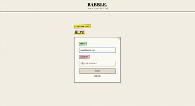
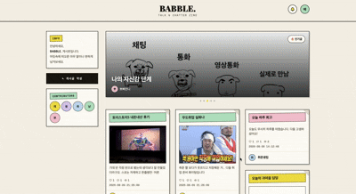
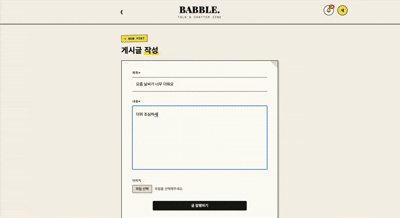
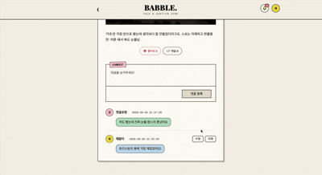
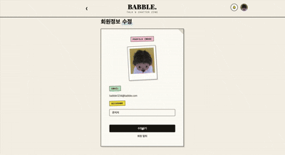
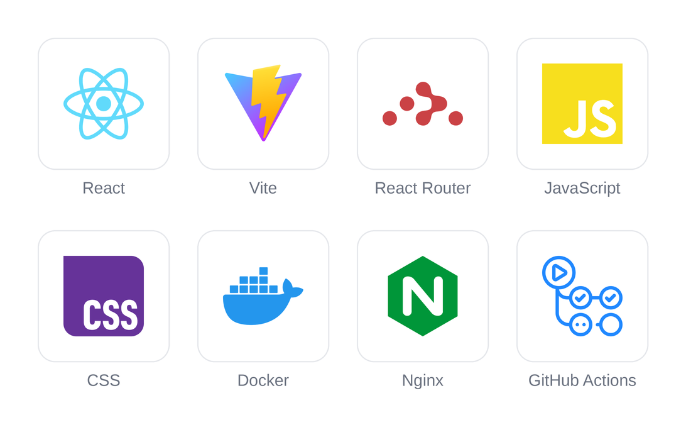
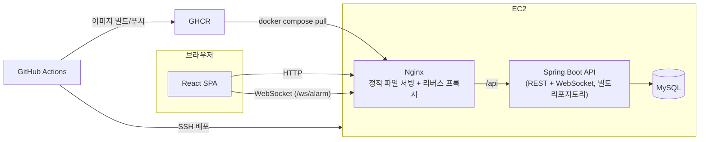

# 🗣️ BABBLE.

> 꾸미지 않아도 괜찮아요, 그냥 재잘거리세요.

`BABBLE.`은 이름 그대로`(babble: 재잘거리다)` 잘 다듬은 글이 아니어도 떠오르는 대로 편하게 남기고, 가볍게 반응을 주고받는 커뮤니티 게시판이에요.

### 끄적여요
글감을 고민할 필요 없어요.<br>
머릿속에 떠오른 아무 말이나, 사진 한 장과 함께 편하게 게시글로 남겨보세요.

### 반응해요
좋아요와 댓글로 가볍게 반응을 주고받고, 실시간 알림으로 내 글에 달린 반응을 바로바로 확인해요.

### 발견해요
인기글 랭킹으로 지금 사람들이 몰리는 이야기를,<br>
Contributors로 이 게시판을 함께 채워가는 사람들을 확인해요.

<br>

## 🚀 Deployment URL

[BABBLE. 바로가기](http://43.201.26.105/)

<br>

## 👤 개발 인원 및 기간

| 항목 | 내용 |
|:--|:--|
| 개발 기간 | 2026.06 ~ 2026.08 |
| 개발 인원 | 1인 (Frontend/Backend 전체 개발) |

<br>

## ✨ 주요 기능

### 1. 로그인 / 회원가입

| 로그인 | 회원가입 |
|:--:|:--:|
|  |  |

### 2. 홈

인기글 Top 5를 자동 슬라이드 캐러셀로, 게시글 목록은 매거진 스타일 카드로 둘러볼 수 있어요.<br>
Contributors로 BABBLE에 기여한 사람들을 확인하고, 프로필 드롭다운으로 어느 페이지에서든 회원정보 수정이나 로그아웃을 바로 할 수 있어요.



<br>

### 3. 게시글 · 댓글 달기

게시글에 댓글을 달고, 내가 쓴 글/댓글은 자유롭게 수정·삭제할 수 있어요. 삭제할 때는 실수로 지우지 않도록 확인 모달이 뜨고, 댓글은 작성자마다 아바타 색이 달라서 누가 남겼는지 한눈에 구분돼요.


| 게시글 작성 | 게시글 수정 | 게시글 삭제 |
|:--:|:--:|:--:|
|  |  |  |


| 댓글 작성 | 댓글 수정 | 댓글 삭제 |
|:--:|:--:|:--:|
|  |  |  |

### 4. 회원 정보 수정 / 탈퇴

| 회원 정보 수정 | 회원 탈퇴 |
|:--:|:--:|
|  |  |

### 5. 실시간 알림

안 읽은 알림만 따로 보는 탭, 전체 읽음 처리, 알림 삭제까지 지원해요.

| 안읽은 알림 탭 | 전체 읽음 처리 | 알림 삭제 |
|:--:|:--:|:--:|
|  |  |  |

<br>

## ⚙️ Tech Stack




<br>

## 🗂️ Project Structure

| 폴더명 | 설명 |
|---|---|
| src/api | API 통신 모듈 |
| src/components | 재사용 가능한 UI 컴포넌트 |
| src/pages | 라우팅되는 페이지 컴포넌트 |
| src/hooks | 커스텀 React 훅 |
| src/contexts | React Context API |
| src/utils | 공통 유틸 함수 |
| public/svg | 아이콘 등 정적 자산 |

<details>
<summary>📂 자세한 폴더 구조 (클릭해서 열기)</summary>

```plaintext
KTB4_Lily_Week7/
├── web/                             # 프론트엔드 (React + Vite)
│   ├── public/
│   │   └── svg/                     # 아이콘 (bell, fire, heart, eye, comment, check, sad)
│   ├── src/
│   │   ├── api/                     # client.js + 도메인별 API 함수
│   │   │   ├── client.js
│   │   │   ├── authApi.js
│   │   │   ├── postApi.js
│   │   │   ├── commentApi.js
│   │   │   ├── notificationApi.js
│   │   │   └── userApi.js
│   │   ├── components/
│   │   │   ├── comment/
│   │   │   ├── common/
│   │   │   ├── layout/
│   │   │   ├── notification/
│   │   │   ├── post/
│   │   │   └── ProtectedRoute.jsx
│   │   ├── contexts/                # AuthContext, ModalContext, NotificationContext
│   │   ├── hooks/                   # useAuth, useModal, useInfiniteScroll, useNotification(Socket)
│   │   ├── pages/                   # 라우트 단위 페이지 8개
│   │   ├── utils/                   # avatarColor, formatRelativeTime, jwt
│   │   ├── App.jsx
│   │   ├── main.jsx
│   │   └── style.css
│   ├── Dockerfile
│   └── package.json
├── docs/                            # 마이그레이션 설계 문서 / 작업 로그 / 이미지
├── deploy/                          # Nginx / systemd 배포 설정
├── docker-compose.yml
└── .github/
    └── workflows/
```

</details>

<br>

## Architecture



프론트/백엔드/DB를 각각 별도 컨테이너(Docker Compose)로 구성하고, `main` 브랜치 푸시 시 GitHub Actions가 이미지를 빌드해 GHCR에 올린 뒤 EC2에 SSH로 접속해 `docker compose pull && up -d`로 배포합니다.

<br>

## Vanilla JS → React 마이그레이션

기존 HTML/CSS/Vanilla JS로 구현된 8개 페이지의 게시판을 React 기반의 컴포넌트·훅·Context 구조로 전환

| 기존 구조 | React 전환 |
|---|---|
| DOM 직접 조작 (`querySelector` + `innerHTML`) | 선언적 UI + 컴포넌트 기반 렌더링 |
| 페이지별 상태 관리 | `AuthContext` / `ModalContext`를 통한 전역 상태 관리 |
| 반복되는 목록 UI | `PostCard` / `CommentItem` 등 재사용 컴포넌트로 분리 |
| 페이지마다 중복되는 로직 | `useAuth` / `useModal` / `useInfiniteScroll` 등 커스텀 훅으로 분리 |

- [설계 문서](docs/react-migration-design.md) : 기존 구조 분석, 컴포넌트/상태 설계, 단계별 마이그레이션 계획
- [작업 로그](docs/migration-log.md) : 마이그레이션 단계별 기록과 판단 근거
- [전환기 블로그](https://velog.io/@soyeong/Vanilla-JS-React-Migration-%EC%A0%84%ED%99%98%EA%B8%B0) Vanilla JS → React Migration 전환기 — 비로소 AI를 "도구"로써 사용하다

<br>

## 성능 개선

알림/게시글 목록처럼 항목 수가 많아질 수 있는 리스트에서 가상화 스크롤(windowing)을 적용하는 작업을 진행 중입니다. 데이터 개수(1,000/5,000/10,000)별로 DOM 노드 수·React 렌더 시간·스크롤 시 메인 스레드 점유를 측정해 적용 전후를 비교하는 방식으로 접근하고 있으며, 자세한 측정 과정과 수치는 별도 브랜치(`notification-virtual-scroll`)에서 정리 중입니다. 안정화되는 대로 이 섹션에 결과를 반영할 예정입니다.

<br>

## 트러블슈팅

<br>

## 프로젝트 회고
